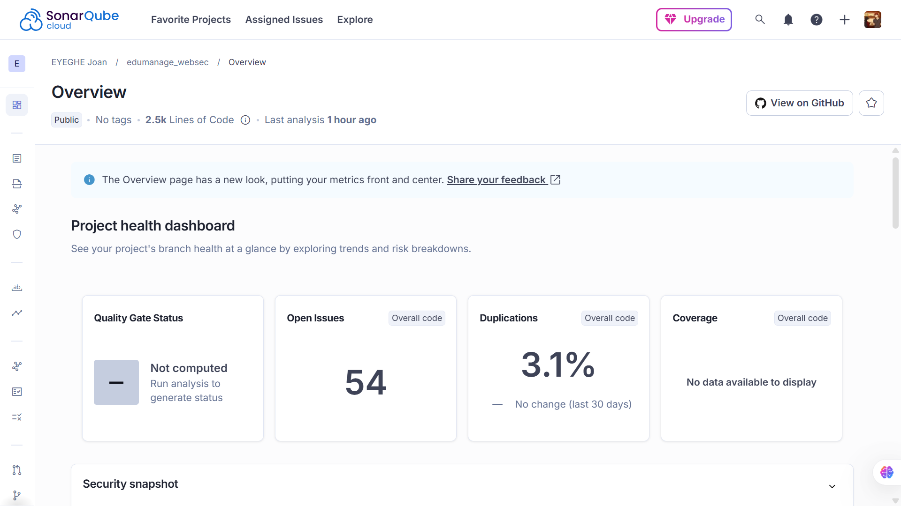
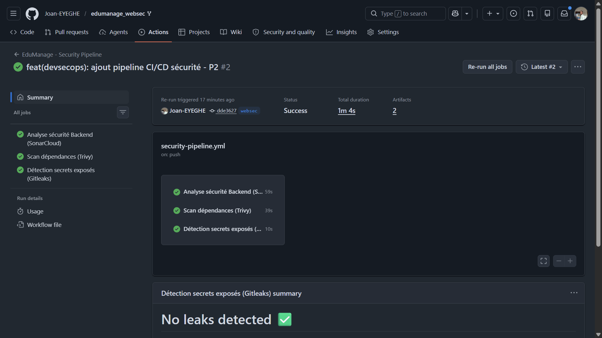

# Rapport SonarCloud — EduManage Secure
> Point P2 — SAST (Static Application Security Testing)  
> Joan Archer | Branche `websec`

---

## Qu'est-ce que SonarCloud ?

SonarCloud est un outil d'**analyse statique de code** (SAST).  
Il lit le code source **sans l'exécuter** et détecte automatiquement :
- Les **bugs** potentiels
- Les **failles de sécurité**
- Les **mauvaises pratiques** de code (code smells)
- Les **duplications** de code

**Pourquoi l'utiliser ici ?**  
Le code d'EduManage n'avait jamais été audité automatiquement. SonarCloud permet de détecter des problèmes de qualité et de sécurité dès le push Git, avant que le code parte en production.

---

## Comment ça s'intègre dans le projet ?

SonarCloud est déclenché automatiquement à chaque `git push` sur la branche `websec` via le pipeline GitHub Actions (fichier `.github/workflows/security-pipeline.yml`).

```
git push → GitHub Actions → SonarCloud analyse le code → Résultats sur le dashboard
```

Aucune commande manuelle n'est nécessaire.

---

## Résultats du scan

| Métrique | Valeur |
|----------|--------|
| **Total issues** | 54 |
| **Duplication de code** | 3.1% |
| **Couverture de tests** | Non disponible |
| **Note Fiabilité** | A |
| **Note Maintenabilité** | A |
| **Quality Gate** | Non calculé (analyse en cours) |

---

## Répartition des issues

### Par catégorie

| Catégorie | Nombre | Sévérité dominante |
|-----------|--------|--------------------|
| Code Smells | 52 | Major |
| Reliability Issues | 53 | Medium |

### Par sévérité

| Sévérité | Proportion |
|----------|------------|
| Medium | 4% |
| Low | 96% |

> ✅ Aucune issue **Critical** ou **Blocker** détectée — le code ne présente pas de faille de sécurité grave.

---

## Analyse des issues trouvées

### Problème 1 — Props non validées dans les composants React (52 issues)

**Fichiers concernés :** `ConfirmDialog.jsx`, `DataTable.jsx`, `FormInput.jsx`, `Modal.jsx`, `Pagination.jsx`, et autres composants dans `frontend/src/components/common/`

**Ce que ça veut dire :**  
Les composants React reçoivent des données (appelées "props") sans vérifier leur type ni leur présence. Si une prop attendue est absente ou du mauvais type, le composant peut planter silencieusement.

**Exemple d'issue :**
```
'isOpen' is missing in props validation — ConfirmDialog.jsx L2
'title' is missing in props validation — ConfirmDialog.jsx L3
```

**Recommandation :**  
Ajouter `PropTypes` dans chaque composant concerné :
```javascript
import PropTypes from 'prop-types';

MonComposant.propTypes = {
  isOpen: PropTypes.bool.isRequired,
  title: PropTypes.string.isRequired,
};
```

---

### Problème 2 — Rejection de Promise sans objet Error (2 issues)

**Fichier concerné :** `frontend/src/api/axios.js` (lignes 29 et 39)

**Ce que ça veut dire :**  
Quand une requête API échoue, le code rejette la Promise avec une valeur quelconque au lieu d'un vrai objet `Error`. Cela rend le débogage difficile car la stack trace est perdue.

**Recommandation :**
```javascript
// ❌ Mauvaise pratique
reject("Une erreur s'est produite");

// ✅ Bonne pratique
reject(new Error("Une erreur s'est produite"));
```

---

### Problème 3 — Context React recréé à chaque rendu (1 issue)

**Fichier concerné :** `frontend/src/context/AuthContext.jsx` (ligne 29)

**Ce que ça veut dire :**  
L'objet passé au Provider du contexte d'authentification est recréé à chaque rendu React, ce qui provoque des re-rendus inutiles de tous les composants qui consomment ce contexte. Impact sur les performances.

**Recommandation :**  
Encapsuler la valeur dans un `useMemo` :
```javascript
const value = useMemo(() => ({ user, login, logout }), [user]);
```

---

## Lien vers le dashboard

🔗 [Voir les résultats sur SonarCloud](https://sonarcloud.io/project/overview?id=Joan-EYEGHE_edumanage_websec)

---

## Captures d'écran

> Les captures se trouvent dans le dossier `screenshots/` ci-dessous.

| Fichier               | Contenu                                 |
|-----------------------|-----------------------------------------|
|  | Vue générale — métriques et Quality Gate |
|       | Vue sur github                          |


---

## Configuration utilisée

| Paramètre | Valeur |
|-----------|--------|
| Organisation SonarCloud | `joan-eyeghe` |
| Project Key | `Joan-EYEGHE_edumanage_websec` |
| Branche analysée | `websec` |
| Intégration | GitHub Actions (`.github/workflows/security-pipeline.yml`) |
